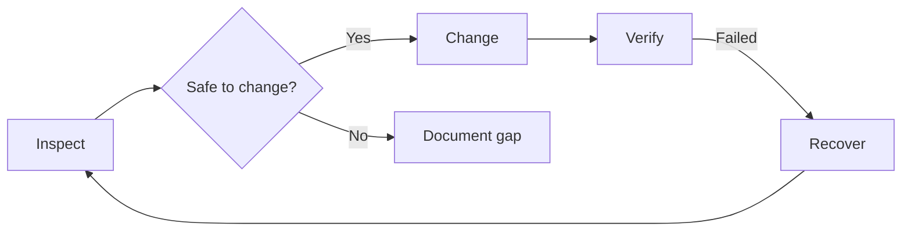

<div align="center">

# VPS Maintenance Playbook

**Maintenance notebook for the Mad House VPS. One server, one bot stack, kept running.**


</div>

---

If you're a fresh AI or you've been away from this server for a while, start here. This notebook covers what's running, how to inspect it safely, and what to do when something breaks. It's grounded in one real environment — not a generic template you have to adapt.

> [!NOTE]
> This is a maintenance notebook, not application source code.
> Bot code lives at [`madebymadhouse/chopsticks-lean`](https://github.com/madebymadhouse/chopsticks-lean).

---

## What's Running

| Service | Container | Port |
|---|---|---|
| Chopsticks Lean bot | `chopsticks-lean-bot` | — |
| PostgreSQL 15 | `chopsticks-lean-postgres` | 5432 (internal) |
| Redis 7 | `chopsticks-lean-redis` | 6379 (internal) |
| Health endpoint | host-exposed | `127.0.0.1:9100/healthz` |

Stack path: `/home/samhcharles/srv/bots/chopsticks-lean`  
Control script: `scripts/ops/chopsticksctl.sh`

---

## Start Here

```bash
# 1. Orient
control-plane/START_HERE_FOR_AGENTS.md
control-plane/CURRENT_STATE.md
control-plane/TOPOLOGY.md

# 2. Run the matching runbook before making any changes
control-plane/RUNBOOKS/
```

> [!WARNING]
> Don't make changes to the running stack without reading the relevant runbook first.
> Every destructive operation — restore, reset, redeploy — has a runbook. Use it.

---

## Runbooks

| Runbook | When to use it |
|---|---|
| [docker-deploy-and-verify.md](./control-plane/RUNBOOKS/docker-deploy-and-verify.md) | Push a stack update, confirm all containers come up healthy |
| [backup-and-restore.md](./control-plane/RUNBOOKS/backup-and-restore.md) | Take a backup or restore from one |
| [logs-health-and-status.md](./control-plane/RUNBOOKS/logs-health-and-status.md) | Check what's running, tail logs, hit the health endpoint |
| [incident-triage.md](./control-plane/RUNBOOKS/incident-triage.md) | Bot is down or acting wrong |
| [vps-audit.md](./control-plane/RUNBOOKS/vps-audit.md) | Full inspection and documentation pass |
| [session-start.md](./control-plane/RUNBOOKS/session-start.md) | Orient yourself before any maintenance session |

---

## How Maintenance Works Here



Three modes, in order. **Inspect first** — read the running state before touching anything. **Change** by following a runbook and verifying after every step. **Recover** with the smallest fix that works; always back up before you restore.

---

## Repository Layout

| Path | Contents |
|---|---|
| `control-plane/` | Current state, topology, workflows, and all runbooks |
| `control-plane/RUNBOOKS/` | Step-by-step maintenance tasks |
| `control-plane/AUDITS/` | Point-in-time inspection snapshots |
| `control-plane/HANDOFFS/` | Handoff notes when passing work between agents |
| `scripts/` | Read-only inspection helpers |
| `.github/agents/` | VPS maintenance agent definition |

---

## What This Repo Is For

Keeping maintenance knowledge out of chat history. When something breaks at 2am and you need to explain the entire server topology to a fresh AI, that's a problem this repo solves. Everything an operator needs to act — verified state, runbooks, audit snapshots — lives here, not in a Slack thread.

It's not for application source code, product docs, or AI workflow theory.

---

## Agents

All agents are in `.github/agents/`. The core ones for this repo:

| Agent | What it does |
|---|---|
| [`@delegator`](./.github/agents/delegator.agent.md) | Your single entry point — describe what you want done, it picks the right agents and runs them in order |
| [`@vps-maintenance-planner`](./.github/agents/vps-maintenance-planner.agent.md) | VPS-specific maintenance — topology, safe change sequences, runbooks |
| [`@context-keeper`](./.github/agents/context-keeper.agent.md) | Write session logs and handoffs after every maintenance session |
| [`@git-keeper`](./.github/agents/git-keeper.agent.md) | Branching, commits, PR descriptions, and keeping the git history clean |
| [`@orchestrator`](./.github/agents/orchestrator.agent.md) | Coordinate a full maintenance pass using the whole fleet |
| [`@security`](./.github/agents/security.agent.md) | Security audit — exposed ports, Docker config, secrets on disk |
| [`@auditor`](./.github/agents/auditor.agent.md) | Structured audit of runbooks, docs, and operational readiness |

Full agent roster: [madebymadhouse/agents](https://github.com/madebymadhouse/agents)

---

## Contributing

If you're maintaining this VPS, keep this repo current. After any maintenance session:
1. Update `control-plane/CURRENT_STATE.md` with anything that changed
2. Update `control-plane/TOPOLOGY.md` if the service layout changed
3. Write a `control-plane/HANDOFFS/YYYY-MM-DD.md` via `@context-keeper` if the session was significant
4. Add a runbook to `control-plane/RUNBOOKS/` for any repeated task you had to figure out manually

The repo is only as useful as it is current. Stale state is worse than no state — it sends the next operator in the wrong direction.

---

## License

[MIT](./LICENSE)
