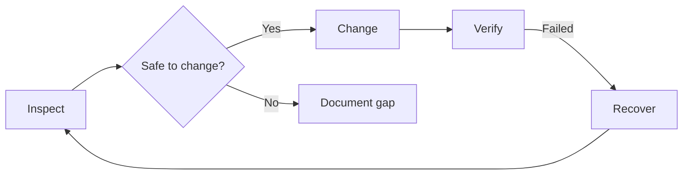

<div align="center">

# VPS Maintenance Playbook

**AI-readable maintenance notebook for a live Ubuntu VPS running Chopsticks Lean.**


</div>

---

A fresh AI or tired human should be able to open this repo and immediately understand what runs on this VPS, how to inspect it safely, and what to do when something breaks. It is grounded in one real environment — not a generic template.

> [!NOTE]
> This is a maintenance notebook, not application source code.
> Bot code lives at [`samhcharles/chopsticks-lean`](https://github.com/samhcharles/chopsticks-lean).

---

## What's Running

| Service | Container | Port |
|---|---|---|
| Chopsticks Lean bot | `chopsticks-lean-bot` | — |
| PostgreSQL 15 | `chopsticks-lean-postgres` | 5432 (internal) |
| Redis 7 | `chopsticks-lean-redis` | 6379 (internal) |
| Health endpoint | host-exposed | `127.0.0.1:9100/healthz` |

Stack path: `/home/samhcharles/srv/bots/chopsticks-lean`
Control script: `scripts/ops/chopsticksctl.sh`

---

## Start Here

```
1. Read control-plane/START_HERE_FOR_AGENTS.md
2. Read control-plane/CURRENT_STATE.md
3. Read control-plane/TOPOLOGY.md
4. Run the relevant RUNBOOK before making changes
```

> [!WARNING]
> Do not make changes to the running stack without reading the relevant runbook first.
> All destructive operations (restore, reset, redeploy) have runbooks — use them.

---

## Runbooks

| Runbook | When to use it |
|---|---|
| [docker-deploy-and-verify.md](./control-plane/RUNBOOKS/docker-deploy-and-verify.md) | Deploy a stack update, verify all containers come up healthy |
| [backup-and-restore.md](./control-plane/RUNBOOKS/backup-and-restore.md) | Create or restore a database backup |
| [logs-health-and-status.md](./control-plane/RUNBOOKS/logs-health-and-status.md) | Check what's running, read logs, verify health endpoint |
| [incident-triage.md](./control-plane/RUNBOOKS/incident-triage.md) | Bot is down or behaving unexpectedly |
| [vps-audit.md](./control-plane/RUNBOOKS/vps-audit.md) | Full VPS inspection and documentation pass |
| [session-start.md](./control-plane/RUNBOOKS/session-start.md) | Orient a fresh session before doing any maintenance |

---

## Three Workflows



**Inspect** — read the running state before touching anything  
**Change** — follow the runbook, verify after every step  
**Recover** — smallest fix first; backup before restore

---

## Repository Layout

| Path | Contents |
|---|---|
| `control-plane/` | State, topology, workflows, and runbooks |
| `control-plane/RUNBOOKS/` | Step-by-step maintenance tasks |
| `control-plane/AUDITS/` | Point-in-time audit snapshots |
| `control-plane/HANDOFFS/` | Agent handoff notes |
| `scripts/` | Read-only inspection helpers |
| `.github/agents/` | VPS maintenance agent definition |

---

## Scope

**This repo is for:**
- Understanding what is running on this VPS
- Keeping maintenance knowledge out of chat-only history
- Making common inspection and recovery tasks repeatable
- Leaving clear notes for the next operator

**This repo is not for:**
- Application source code
- Broad AI workflow theory
- Product documentation

---

## License

[MIT](./LICENSE)
- Read the current state and tell me the safest next maintenance step.

## License

MIT
